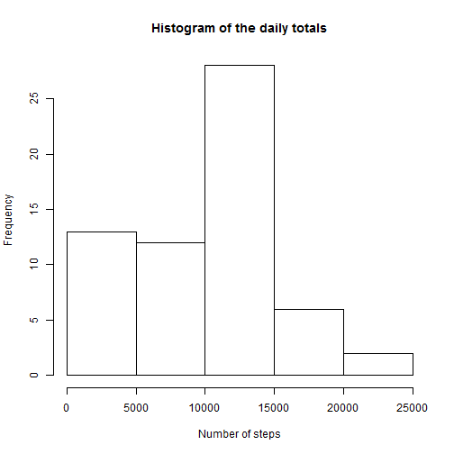
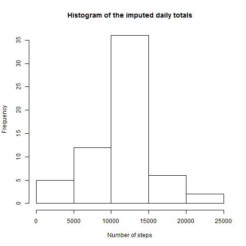
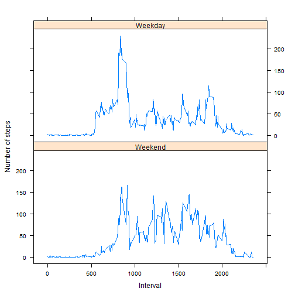

##Loading and preprocessing the data

Show any code that is needed to  
1. Load the data (i.e. read.csv())  
2. Process/transform the data (if necessary) into a format suitable for your analysis


```r
##load the data
d <- read.csv("./data/repdata-data-activity/activity.csv")
##show a sample of the data
head(d, 10)
```

```
##    steps       date interval
## 1     NA 2012-10-01        0
## 2     NA 2012-10-01        5
## 3     NA 2012-10-01       10
## 4     NA 2012-10-01       15
## 5     NA 2012-10-01       20
## 6     NA 2012-10-01       25
## 7     NA 2012-10-01       30
## 8     NA 2012-10-01       35
## 9     NA 2012-10-01       40
## 10    NA 2012-10-01       45
```


##What is mean total number of steps taken per day?

For this part of the assignment, you can ignore the missing values in the dataset.

1. Calculate the total number of steps taken per day

2. If you do not understand the difference between a histogram and a barplot, research the difference between them. Make a histogram of the total number of steps taken each day

3. Calculate and report the mean and median of the total number of steps taken per day


```r
##calculate the total number of steps per day
daytot <- tapply(d$steps, d$date, sum, na.rm=TRUE)
names(daytot) <- levels(d$date)

##make a histogram of the daily totals
hist(daytot, main = "Histogram of the daily totals", xlab="Number of steps")
```

 

```r
##calculate the mean/median with summary function
summary(daytot)
```

```
##    Min. 1st Qu.  Median    Mean 3rd Qu.    Max. 
##       0    6778   10400    9354   12810   21190
```

```r
print(paste("The mean and median of the total number of steps taken per day are", summary(daytot)[4], "and", summary(daytot)[3], "respectively."))
```

```
## [1] "The mean and median of the total number of steps taken per day are 9354 and 10400 respectively."
```


    
##What is the average daily activity pattern?

1. Make a time series plot (i.e. type = "l") of the 5-minute interval (x-axis) and the average number of steps taken, averaged across all days (y-axis)


```r
##turn interval column into a factor
d$interval <- factor(d$interval)
##use tapply to calculate average 5-minute intervals
interval_avg <- tapply(d$steps, d$interval, mean, na.rm=TRUE)

##plot the data
plot(levels(d$interval), interval_avg, type="l", main="Average daily activity pattern", xlab="5-minute interval", ylab="Average number of steps taken")
```

 

2. Which 5-minute interval, on average across all the days in the dataset, contains the maximum number of steps?


```r
##assign names to the interval_avg vector(a vector of 5-min. averages)
names(interval_avg) <- levels(d$interval)
##calculate maximum value among the 5-minute averages and return its name

print(paste("The 5-min interval with the maximum average number of steps is ",names(interval_avg[max(interval_avg)]), ".", sep=""))
```

```
## [1] "The 5-min interval with the maximum average number of steps is 1705."
```


    
##Imputing missing values

Note that there are a number of days/intervals where there are missing values (coded as NA). The presence of missing days may introduce bias into some calculations or summaries of the data.

1. Calculate and report the total number of missing values in the dataset (i.e. the total number of rows with NAs)


```r
##calculate the number of total NAs
summary(is.na(d$steps))
```

```
##    Mode   FALSE    TRUE    NA's 
## logical   15264    2304       0
```

```r
print(paste("The total number of missing values in the dataset is ", summary(is.na(d$steps))[3], ".", sep=""))
```

```
## [1] "The total number of missing values in the dataset is 2304."
```

2. Devise a strategy for filling in all of the missing values in the dataset. The strategy does not need to be sophisticated. For example, you could use the mean/median for that day, or the mean for that 5-minute interval, etc.

3. Create a new dataset that is equal to the original dataset but with the missing data filled in.


```r
##I chose to use the mean for the 5-min. interval for imputation

new_d <- d
##test if an entry is NA and if so, replace with a value from interval_avg calculated in the previous section
for(i in 1:nrow(new_d)){
        if (is.na(new_d$steps[i])){
                new_d$steps[i] <-    
                interval_avg[names(interval_avg)==new_d$interval[i]]
        }
}
head(new_d,10)
```

```
##        steps       date interval
## 1  1.7169811 2012-10-01        0
## 2  0.3396226 2012-10-01        5
## 3  0.1320755 2012-10-01       10
## 4  0.1509434 2012-10-01       15
## 5  0.0754717 2012-10-01       20
## 6  2.0943396 2012-10-01       25
## 7  0.5283019 2012-10-01       30
## 8  0.8679245 2012-10-01       35
## 9  0.0000000 2012-10-01       40
## 10 1.4716981 2012-10-01       45
```

4. Make a histogram of the total number of steps taken each day and Calculate and report the mean and median total number of steps taken per day. Do these values differ from the estimates from the first part of the assignment? What is the impact of imputing missing data on the estimates of the total daily number of steps?


```r
##calculate daily totals using tapply
daytot2 <- tapply(new_d$steps, new_d$date, sum)
names(daytot2) <- levels(new_d$date)

##make a histogram of the daily totals
hist(daytot2, main="Histogram of the imputed daily totals", xlab="Number of steps")
```

 

```r
##calculate the mean/median with summary function and report them.
summary(daytot2)
```

```
##    Min. 1st Qu.  Median    Mean 3rd Qu.    Max. 
##      41    9819   10770   10770   12810   21190
```

```r
print(paste("The mean and median of the total number of steps taken per day are", summary(daytot2)[4], "and", summary(daytot2)[3], "respectively."))
```

```
## [1] "The mean and median of the total number of steps taken per day are 10770 and 10770 respectively."
```

```r
##create a matrix that compares mean/median of daily totals from original and imputed data
m<- matrix(nrow=2, ncol=2)
m[,1] <- c(summary(daytot)[4], summary(daytot)[3])
m[,2] <- c(summary(daytot2)[4], summary(daytot2)[3])
colnames(m) <- c("Original", "Imputed")
rownames(m) <- c("Mean", "Median")
m
```

```
##        Original Imputed
## Mean       9354   10770
## Median    10400   10770
```

Answers to Questions: The mean and median of the imputed data are both higher than those of the original data. Since missing data were simply omitted in the previous calculation of daily totals, with missing data replaced with some positive numbers, the new daily totals are higher than the original.

    
##Are there differences in activity patterns between weekdays and weekends?

For this part the weekdays() function may be of some help here. Use the dataset with the filled-in missing values for this part.

1. Create a new factor variable in the dataset with two levels -"weekday" and "weekend" indicating whether a given date is a weekday or weekend day.


```r
##create a new date column that is in "date" class. (not factor)
new_d$date2 <- as.Date(new_d$date)
##set time setting in case the default is not English.
Sys.setlocale("LC_TIME", "English")
```

```
## [1] "English_United States.1252"
```

```r
##create a new column "WK" assigning either weekday or weekend accordingly
new_d$wk <- ifelse(weekdays(new_d$date2, abbreviate=TRUE) %in% c("Mon", "Tue", "Wed", "Thu", "Fri"), "weekday", "weekend")
new_d$wk <- factor(new_d$wk)

##result
str(new_d)
```

```
## 'data.frame':	17568 obs. of  5 variables:
##  $ steps   : num  1.717 0.3396 0.1321 0.1509 0.0755 ...
##  $ date    : Factor w/ 61 levels "2012-10-01","2012-10-02",..: 1 1 1 1 1 1 1 1 1 1 ...
##  $ interval: Factor w/ 288 levels "0","5","10","15",..: 1 2 3 4 5 6 7 8 9 10 ...
##  $ date2   : Date, format: "2012-10-01" "2012-10-01" ...
##  $ wk      : Factor w/ 2 levels "weekday","weekend": 1 1 1 1 1 1 1 1 1 1 ...
```

2. Make a panel plot containing a time series plot (i.e. type = "l") of the 5-minute interval (x-axis) and the average number of steps taken, averaged across all weekday days or weekend days (y-axis). See the README file in the GitHub repository to see an example of what this plot should look like using simulated data.


```r
##split new_d data based on wk column and assign each to wday/ wend
wday <- new_d[new_d$wk=="weekday",]
wend <- new_d[new_d$wk=="weekend",]

##turn interval column into a factor
new_d$interval <- factor(new_d$interval)

##calculate 5-min averages for wday and wend data separately and merge them into a dataframe
avg1 <- data.frame(avg=rep(0,288))
avg1$avg <- tapply(wday$steps, wday$interval, mean)
avg1$int <- as.numeric(levels(new_d$interval))
avg1$wk <- rep("Weekday", 288)

avg2 <- data.frame(avg=rep(0,288))
avg2$avg <- tapply(wend$steps, wend$interval, mean)
avg2$int <- as.numeric(levels(new_d$interval))
avg2$wk <- rep("Weekend", 288)

avg_d <- rbind(avg1, avg2)
avg_d$wk <- factor(avg_d$wk, levels=c("Weekend", "Weekday"))

##create a panel plot of time series plots for wday and wend average daily patterns
library(lattice)
xyplot(avg ~ int | wk, data=avg_d, layout=c(1,2), type="l",  xlab="Interval", ylab="Number of steps")
```

 
